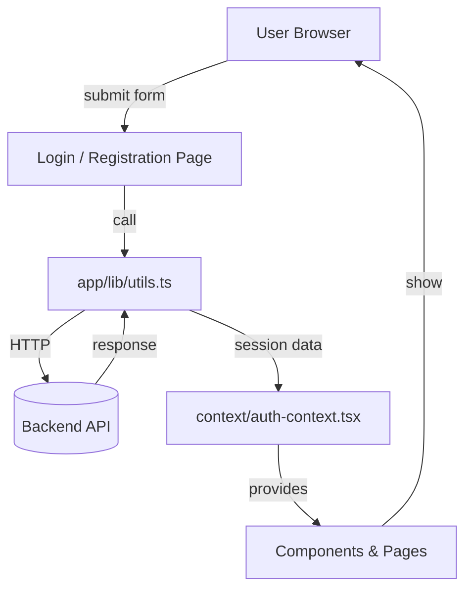

# Votum — User Registration (Votum-UserReg)

Professional README for the Votum user registration frontend application.

## Project Overview

Votum-UserReg is the frontend part of Votum, a secure, modern web application for voter registration and user management. Built with Next.js and TypeScript, it provides responsive UI components, authentication context, and pages for registration, login, and profile management.

Key goals:
- Fast, accessible, and mobile-friendly UI
- Clean component library and design system
- Simple integration with backend authentication and APIs

## Features

- Next.js + TypeScript application
- Reusable UI components under `app/components/ui`
- Authentication context (`app/context/auth-context.tsx`)
- Pages: login, registration, profile, dashboard, election details
- Utility and mock data helpers in `app/lib`

## Repository structure

- `app/` — Next.js app directory (pages, components, styles)
- `app/components/ui/` — Design system and atomic UI components
- `app/context/` — React context providers (auth)
- `app/hooks/` — Custom hooks (mobile detection, toast)
- `app/lib/` — Types, utils, and mock data
- `styles/` — Global styles
- `jest.config.ts`, `eslint.config.mjs` — Test & lint config

## Prerequisites

- Node.js 18+ (recommended)
- npm 9+ or yarn 1.22+ / pnpm 7+
- (Optional) Docker for containerized builds

## Environment

Create a `.env.local` at the project root (not committed). Example variables the app expects:

```
NEXT_PUBLIC_API_URL=http://localhost:4000
NEXTAUTH_URL=http://localhost:3000
NEXTAUTH_SECRET=your_nextauth_secret
```

Adjust variables to match your backend/auth provider configuration.

## Installation

Clone and install dependencies:

```bash
git clone <repo-url>
cd Votum-UserReg/votum-user
npm install
# or: yarn install
```

## Development (Local)

Run the Next.js development server:

```bash
npm run dev
# or: yarn dev
```

Open http://localhost:3000 in your browser. The app supports HMR for fast iteration.

## Production Build

Build and start locally to validate production artifacts:

```bash
npm run build
npm run start
```

## Docker (Optional)

Build and run with Docker:

```bash
docker build -t votum-user .
docker run -p 3000:3000 --env-file .env.local votum-user
```

## Testing

Unit and integration tests use Jest. Run tests with:

```bash
npm test
# or: npm run test:watch
```

Test output files are in the repo (e.g., `login_test_output.txt`, `test_output.txt`) for reference.

## Linting & Formatting

Run ESLint:

```bash
npm run lint
```

Code formatting uses Prettier (if configured). Run formatter or add a pre-commit hook in CI.

## How to Connect to a Backend

1. Set `NEXT_PUBLIC_API_URL` in `.env.local` to point to your backend API.
2. Ensure authentication endpoints and NextAuth configuration match the backend.
3. Update API call locations in `app/lib/utils.ts` if necessary.

## Adding New Components

- Add new atomic components under `app/components/ui`.
- Follow existing patterns for props, types in `app/lib/types.ts`, and styling.

## Contributing

1. Fork the repo and create a feature branch.
2. Open a pull request against `main` with a clear description and tests.
3. Ensure CI passes and linting checks are green.

## Security & Privacy

- Do not commit secrets or `.env.local` to the repository.
- Use HTTPS in production and proper CORS and auth policies on the backend.

## License

Specify your license here (e.g. MIT). If none, add one to the repository.

## Maintainers / Contact

For questions or help, contact the project maintainers or open an issue in the repository.

---

This README provides a concise professional overview and practical instructions to run and contribute to Votum-UserReg. If you want, I can add CI examples, a sample `.env.local` template, or a development checklist.

## End-to-end flow (user -> backend -> UI)

This section describes the typical runtime flow and where to look for each step when developing or debugging the app.

1. User interaction
	- The user interacts with UI pages under `components/` (for example `registration-page.tsx` or `login-page.tsx`). Inputs are validated by component logic and form helpers in `components/ui/form.tsx`.
2. API call
	- Pages call helpers in `lib/utils.ts` to perform network requests. `utils.ts` reads `NEXT_PUBLIC_API_URL` and constructs endpoints (e.g., `/auth/login`, `/users/register`, `/elections`).
3. Auth & session
	- On successful authentication, `lib/utils.ts` returns tokens/session data to the caller which then calls `context/auth-context.tsx` APIs (e.g., `setUser`, `setSession`) to persist session state.
4. State propagation
	- `auth-context` exposes the logged-in user and helpers to the rest of the tree via React Context; UI components (navbar, protected pages) use this context to alter behavior (show/hide links, redirect).
5. Protected resources
	- Dashboard and profile pages request protected data via `lib/utils.ts`. Helpers attach tokens (if required) or rely on cookie/session-based auth depending on your backend.
6. UI feedback
	- `use-toast.ts` and `components/ui/toast.tsx` show success/error notifications after API responses.

## Data flow (diagram)



## Component interaction examples

- Login flow: `components/login-page.tsx` -> `lib/utils.ts` (auth endpoint) -> `context/auth-context.tsx` (set session) -> `components/navbar.tsx` (update links)
- Registration flow: `components/registration-page.tsx` -> `lib/utils.ts` (create user) -> optional auto-login via `auth-context` -> redirect to `dashboard-page.tsx`
- Data listing: `dashboard-page.tsx` calls `lib/utils.ts` to fetch lists (elections/users), maps results to `components/ui/table.tsx` for rendering.

## Where to change behavior (quick map)

- Change API endpoint paths or auth header behavior: `votum-user/lib/utils.ts`
- Change session storage or refresh logic: `votum-user/context/auth-context.tsx`
- Update UI primitives or add accessible components: `votum-user/components/ui/*`
- Add cross-cutting behavior (logging, error mapping): modify `votum-user/lib/utils.ts` and `votum-user/hooks/use-toast.ts`

## Developer checklist (start here for a feature)

- Create a feature branch from `main`.
- Add UI atom(s) in `components/ui` if reusable.
- Implement page under `components/` and compose UI atoms.
- Add/adjust API helper in `lib/utils.ts` for server interaction.
- Update or use `auth-context` for any authentication side-effects.
- Add unit tests (Jest) for new utilities and components.
- Run `npm run dev` and verify flows locally.

---

If you'd like, I can commit a sample `.env.local` template file and a `DOCS.md` containing an expanded Mermaid diagram and sequence diagrams for each flow. Which should I add next?

## File structure (detailed)

Below is the repo layout and a short description for each folder and important files to help you navigate and extend the project.

- `README.md` — this file (overview, setup, flows, and structure).
- `votum-user/` — the actual Next.js application. Key files inside:
	- `app/`
		- `page.tsx` — root landing page for the app.
		- `layout.tsx` — application layout and provider injection (global providers, head tags).
		- `globals.css` — app-level global styles.
	- `components/` — page-level components composed from UI primitives:
		- `login-page.tsx`, `registration-page.tsx`, `profile-page.tsx`, `dashboard-page.tsx`, `election-details-page.tsx` — route views used by the app.
		- `navbar.tsx` — top navigation that reads `auth-context` to show correct links.
		- `ui/` — design system primitives (buttons, inputs, dialogs, toast, table, form controls). These are reusable across pages.
	- `context/`
		- `auth-context.tsx` — React Context provider for authentication and session management.
	- `hooks/`
		- `use-mobile.tsx` — helper hook for responsive/mobile behavior.
		- `use-toast.ts` — hook to show toasts/notifications from components.
	- `lib/`
		- `utils.ts` — central API helpers and network wrappers (the primary integration point with the backend; reads `NEXT_PUBLIC_API_URL`).
		- `types.ts` — shared TypeScript types and interfaces (User, Election, API payloads).
		- `mock-data.ts` — development mock data for components and local testing.
	- `styles/` — app-specific CSS (if present) and shared styling assets.
	- `Dockerfile` — container build for production deployment of the Next.js app.

- Top-level files (project root):
	- `package.json` / `package-lock.json` — dependencies and scripts (`dev`, `build`, `start`, `test`, `lint`).
	- `next.config.ts` — Next.js configuration.
	- `tsconfig.json` — TypeScript configuration.
	- `jest.config.ts`, `jest.setup.ts` — Jest test configuration and setup.
	- `eslint.config.mjs` — eslint configuration for the project.
	- `.dockerignore`, `.gitignore` — ignore rules for Docker and git.

Notes / how things connect:
- UI primitives in `components/ui` are intentionally stateless and imported into page-level components in `components/`.
- All backend interaction should go through `lib/utils.ts` to keep networking concerns centralized and consistent (token handling, base URL, error mapping).
- `context/auth-context.tsx` is the single authority for session state — update here for token storage or refresh logic.

If you'd like, I will mark this task complete and (optionally) add a `.env.local.template` file and a `DOCS.md` with an expanded Mermaid diagram. Which should I add next?
